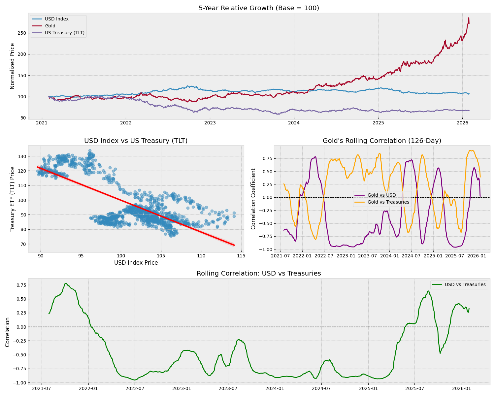

# Market Relationships Analysis
**Analyzing the Correlation between USD, Gold, and US Treasuries**

This project analyzes the historical price data (last 5 years) of the US Dollar Index, Gold, and US Treasury Bonds to understand their interdependencies and distinct growth patterns.

## 📊 Visualizations


*(Generated by `market_analysis.py`)*

---

## 🔍 Key Findings

### 1. USD vs Treasuries: The "Risk-Off" Dynamic
**Correlation: -0.74 (Strong Inverse Relationship)**
*   **Observation**: There is a strong negative correlation between the US Dollar (`DX-Y`) and US Treasury Prices (`TLT`).
*   **Interpretation**: When the Dollar strengthens (often due to rising interest rates), bond prices typically fall (as yields rise). This confirms the classic inverse relationship between currency strength/rates and bond values.

### 2. Gold's Independence
**Correlation with USD: -0.03 (Near Zero)**
**Correlation with Treasuries: -0.46**
*   **Observation**: Gold (`GC=F`) shows a near-zero correlation with the US Dollar over the 5-year period.
*   **Interpretation**: Gold "grows at its own rate." It is not merely an anti-dollar asset anymore; its price is driven by a complex mix of inflation expectations, geopolitical instability, and central bank buying, making it largely independent of daily Dollar moves.

---

## 🛠️ Setup & Usage

### Prerequisites
*   Python 3.x
*   `yfinance`
*   `matplotlib`
*   `seaborn`
*   `pandas`

### Installation
```bash
pip install yfinance matplotlib seaborn pandas
```

### Running the Analysis
Run the script to fetch fresh data and regenerate the plot:
```bash
python3 market_analysis.py
```
This will download the latest data from Yahoo Finance and save the chart to `market_relationships.png`.
